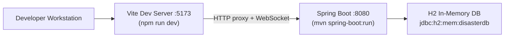
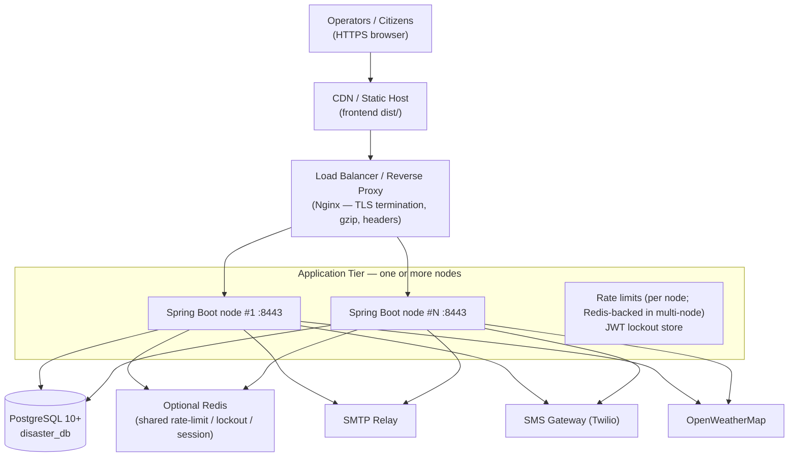

# Deployment Diagram — AI Disaster Management System

> Rendered as a Mermaid `flowchart`. Shows the production topology for a small
> government datacenter or cloud tenancy, plus the local development topology.

## Local development topology



## Production topology



## Node deployment (per application instance)

| Concern | Detail |
|---------|--------|
| JVM | Temurin JDK 17, `-Xms512m -Xmx1g` (adjust by load) |
| Artifact | `mvn package` → `target/ai-disaster-management-2.0.0.jar` |
| Run | `java -jar ai-disaster-management-2.0.0.jar --spring.profiles.active=postgres` |
| Config | Secrets via environment: `JWT_SECRET`, `SPRING_DATASOURCE_*`, `WEATHER_API_KEY`, `SPRING_MAIL_*`, `SMS_TWILIO_*` |
| Health checks | `GET /actuator/health`, `GET /actuator/info` |
| Logs | JSON to stdout → central log collector (EFK / Loki) |

## Recommended container manifest (Docker Compose example)

```yaml
services:
  backend:
    image: ai-disaster-management:2.0.0
    environment:
      SPRING_PROFILES_ACTIVE: postgres
      JWT_SECRET: ${JWT_SECRET}
      SPRING_DATASOURCE_URL: jdbc:postgresql://db:5432/disaster_db
      SPRING_DATASOURCE_USERNAME: ${DB_USER}
      SPRING_DATASOURCE_PASSWORD: ${DB_PASSWORD}
    depends_on:
      - db
    ports:
      - "8080:8080"
    healthcheck:
      test: ["CMD", "curl", "-f", "http://localhost:8080/actuator/health"]
      interval: 30s
      timeout: 5s
      retries: 3

  db:
    image: postgres:16-alpine
    environment:
      POSTGRES_DB: disaster_db
      POSTGRES_USER: ${DB_USER}
      POSTGRES_PASSWORD: ${DB_PASSWORD}
    volumes:
      - pgdata:/var/lib/postgresql/data

  frontend:
    image: nginx:alpine
    volumes:
      - ../frontend/dist:/usr/share/nginx/html:ro
      - ./nginx.conf:/etc/nginx/conf.d/default.conf:ro
    depends_on:
      - backend

volumes:
  pgdata:
```

## Production runbook notes

- **Backups:** schedule `pg_dump` (e.g. `pg_dump -Fc disaster_db > disaster_db.dump`) with
  retention; attachments are stored in DB LOB columns so a single dump captures everything.
- **Upgrades:** release a new jar, run Flyway migrations automatically on boot, keep old
  node draining until health checks pass, then flip the load balancer.
- **TLS:** terminate at the reverse proxy; force HSTS (already set to 1 year by the backend).
- **Scaling:** stateless app tier scales horizontally; move rate-limit/lockout state to
  Redis when running more than one node.
- **Monitoring:** wire `/actuator/metrics` into Prometheus; alert on `429` spikes (brute
  force) and repeated account lockouts.
