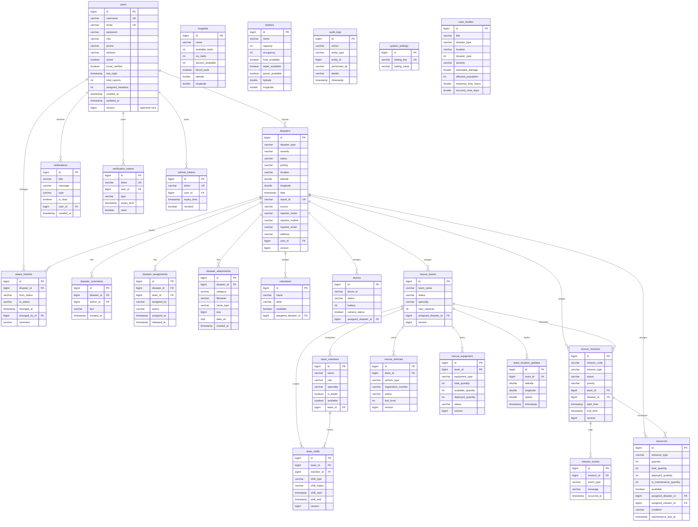

# Entity Relationship (ER) Diagram — AI Disaster Management System

> Rendered below as a Mermaid `erDiagram`. GitHub, GitLab and any Mermaid-compatible
> viewer render this natively. The schema is managed with Flyway migrations in
> `backend/src/main/resources/db/migration/V1__init_schema.sql` … `V7__performance_indexes.sql`
> and validated at boot by Hibernate (`ddl-auto=validate`). Works on H2 (PostgreSQL
> compatibility mode) and PostgreSQL.

## Key relationships

| From | To | Cardinality | Meaning |
|------|-----|-------------|---------|
| `users` | `disasters` | 1 : N | A user reports many disasters |
| `users` | `notifications` | 1 : N | Each notification targets one user |
| `disasters` | `status_timeline` | 1 : N | Full status history per disaster |
| `disasters` | `disaster_comments` | 1 : N | Collaboration thread per disaster |
| `disasters` | `disaster_attachments` | 1 : N | Photo/PDF/video evidence |
| `disasters` | `rescue_teams` | 1 : N | Teams assigned to a disaster |
| `rescue_teams` | `team_members` | 1 : N | Team composition |
| `rescue_teams` | `rescue_vehicles` / `rescue_equipment` | 1 : N | Assets owned by a team |
| `rescue_teams` | `rescue_missions` | 1 : N | Missions executed by a team |
| `rescue_missions` | `mission_events` | 1 : N | Mission event log |
| `rescue_teams` | `team_shifts` | 1 : N | Duty roster; each shift also references a `team_members` row |
| `users` | `verification_tokens` / `refresh_tokens` | 1 : N | Email verification and session refresh |

## Concurrency & integrity notes

- **Optimistic locking:** `version` columns on `users`, `disasters`, `rescue_teams`,
  `team_members`, `rescue_vehicles`, `rescue_equipment`, `rescue_missions`, `team_shifts`
  and `resources` are incremented on write. Conflicts surface as
  `409 Conflict` via `GlobalExceptionHandler`.
- **Soft state:** user accounts use an `active` flag; no rows are physically removed.
- **Indexes:** composite indexes exist for the hottest paths
  (`notifications(user_id, is_read)`, `team_location_updates(team_id, timestamp)`,
  `team_shifts(shift_start, shift_end)`, `team_members(team_id, is_leader)`) and are
  defined in migration `V7__performance_indexes.sql`.
