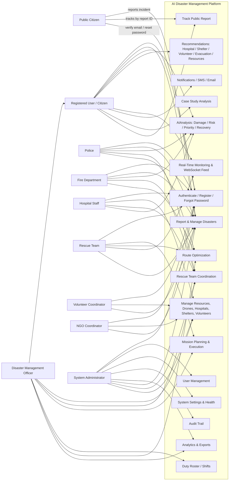

# Use Case Diagram — AI Disaster Management System

> Rendered as a Mermaid `flowchart`. Actors are drawn from the RBAC matrix in
> `RbacService` plus the unauthenticated public citizen.

## Actor / permission summary

| Actor | Key capabilities | RBAC role |
|-------|------------------|-----------|
| Public Citizen | Submit and track disaster reports (no login) | — (public endpoints) |
| Registered User | Report disasters, run AI analysis, view maps/analytics, notifications | `USER` |
| Disaster Management Officer | Command & control: disasters, rescue teams, missions, shifts, resources, analytics | `DMO` |
| Police | View/report disasters, view teams, routing | `POLICE` |
| Fire Department | View/report disasters, view teams, routing | `FIRE_DEPARTMENT` |
| Hospital Staff | Manage hospitals, view disasters/resources/teams | `HOSPITAL_STAFF` |
| Rescue Team | View assigned missions, routing, live monitoring | `RESCUE_TEAM` |
| Volunteer Coordinator | Manage volunteers and shelters | `VOLUNTEER_COORDINATOR` |
| NGO Coordinator | Manage shelters, view volunteers | `NGO_COORDINATOR` |
| System Administrator | Full access: users, settings, health, audit, everything | `ADMIN` |

The permission matrix is enforced server-side via
`@PreAuthorize("@rbacService.hasPermission(...)")` and mirrored to the frontend in the
login payload for menu/route filtering.
